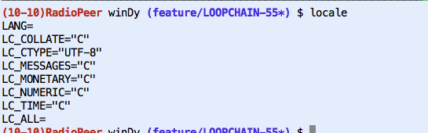

| [home](http://windystudio.net/) | [programming](http://windystudio.net/programming/) | [tmux_in_action](#) |

----------

 * TMUX 기본 명령어
http://www.haruair.com/blog/2124

- max pane(toggle) : ctrl + b, z

----------

 * TMUX 한글(utf-8) 깨질때 확인할 것
locale 설정 확인 (첨부 이미지)
-u option (이거 때문에 되는건지? 확실하지 않음)
http://askubuntu.com/questions/410048/utf-8-character-not-showing-properly-in-tmux

----------

 * TMUX 에서 마우스 활성화하기

(~/.tmux.conf 파일을 다음과 같이 작성한다.)

```
# Toggle mouse on with ^B m
bind m \
	set-option -g mouse on \;\
	display 'Mouse: ON'

# Toggle mouse off with ^B M
bind M \
	set-option -g mouse off \;\
	display 'Mouse: OFF'
```

  * 변경한 conf 파일을 적용한다.

$ tmux source-file ~/.tmux.conf



----------

* 마우스 선택 영역 자동 copy (출처: https://unix.stackexchange.com/questions/318281/how-to-copy-and-paste-with-a-mouse-with-tmux)

.tmux.conf 에 다음 내용을 추가합니다.
```
# macOS only
set -g mouse on
bind -n WheelUpPane if-shell -F -t = "#{mouse_any_flag}" "send-keys -M" "if -Ft= '#{pane_in_mode}' 'send-keys -M' 'select-pane -t=; copy-mode -e; send-keys -M'"
bind -n WheelDownPane select-pane -t= \; send-keys -M
bind -n C-WheelUpPane select-pane -t= \; copy-mode -e \; send-keys -M
bind -T copy-mode-vi    C-WheelUpPane   send-keys -X halfpage-up
bind -T copy-mode-vi    C-WheelDownPane send-keys -X halfpage-down
bind -T copy-mode-emacs C-WheelUpPane   send-keys -X halfpage-up
bind -T copy-mode-emacs C-WheelDownPane send-keys -X halfpage-down

# To copy, left click and drag to highlight text in yellow, 
# once you release left click yellow text will disappear and will automatically be available in clibboard
# # Use vim keybindings in copy mode
setw -g mode-keys vi
# Update default binding of `Enter` to also use copy-pipe
unbind -T copy-mode-vi Enter
bind-key -T copy-mode-vi Enter send-keys -X copy-pipe-and-cancel "pbcopy"
bind-key -T copy-mode-vi MouseDragEnd1Pane send-keys -X copy-pipe-and-cancel "pbcopy"
```
